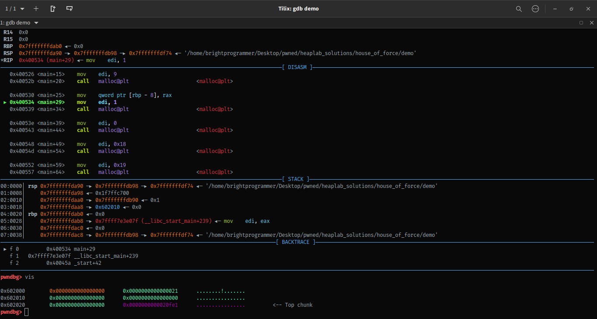
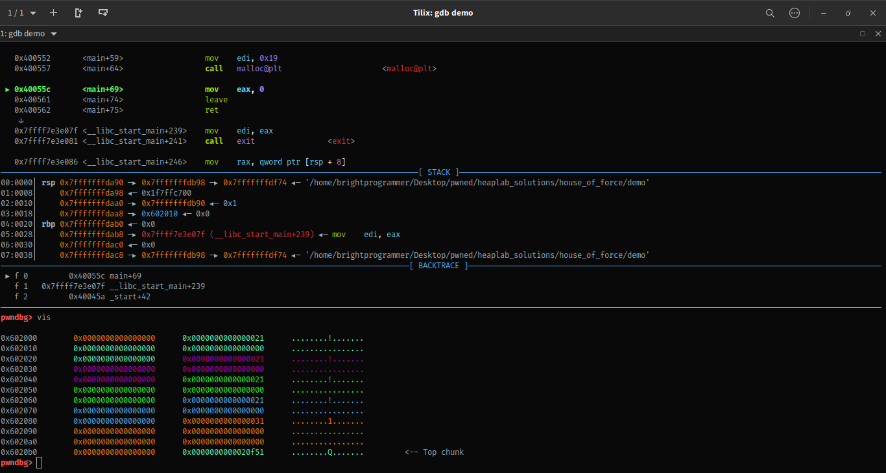
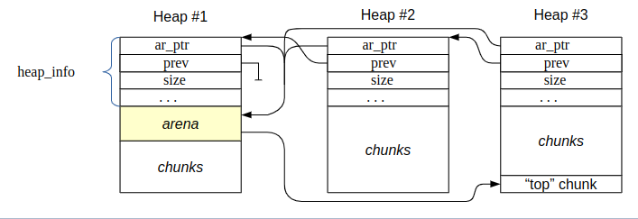
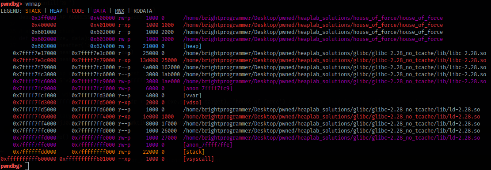

# House Of Force

## Building `glibc`

Opening the **demo** file in gdb throws error. After some messing around with random things, my eyes accidentally fell on the interpreter section of this binary (PS : Interpreter is something that is responsible for loading the program when a program requests it! pwncollege as a very good introduction to linkers and loaders in program interaction module). The linker path that was given there was invalid as there was no binary present there. Luckily the name of interpreter gives some useful information! It's glibc 2.28 and with tcache enabled. I downloaded glib 2.28 source code from [here](https://ftp.gnu.org/gnu/glibc/) and I took reference from offical gnu documentation pages to build a glibc without tcache.  

- [Configuring and Compiling](https://www.gnu.org/software/libc/manual/html_node/Configuring-and-compiling.html)
  - Take a look at `--disable-experimental-malloc` option. This will help us disable tcache completely.  

Disabling of `tcache` can also be done per application basis using [TUNABLES](https://www.gnu.org/software/libc/manual/html_node/Tunables.html). Building glibc is now easy. Execute `mkdir build; cd build; ../configure --disable-experimental-malloc --prefix="/path/where/you/will/install/this/glibc" --disable-werror; make -j8`. It took over 7 minutes to build on my i3 7th gen with 8GB ram and 120G SSD.

Next task is to patch the **demo** binary in order to be able to run it. First we set a valid rpath using `patchelf --set-rpath ../glibc/glibc-2.28_no_tcache/lib demo`. Next we replace the interpreter by issuing `patchelf --set-interpreter ../glibc/glibc-2.28_no_tcache/ld-linux-x86-64.so.2 demo`.  

After patching the linker my binary started working like a charm.

## Dynamic Memory Allocation
Dynamic memory allocation is done by using the libc's `malloc` function. There are some helper functions provided by current malloc implementation that helps in memory management.  

- Standard (ANSI/SVID/...)  functions:
    - malloc(size_t n); 
    - calloc(size_t n_elements, size_t element_size);
    - free(void* p);
    - realloc(void* p, size_t n);
    - memalign(size_t alignment, size_t n);
    - valloc(size_t n);
    - mallinfo()
    - mallopt(int parameter_number, int parameter_value)  

- Additional functions:
    - independent_calloc(size_t n_elements, size_t size, void* chunks[]);
    - independent_comalloc(size_t n_elements, size_t sizes[], void* chunks[]);
    - pvalloc(size_t n);
    - malloc_trim(size_t pad);
    - malloc_usable_size(void* p);
    - malloc_stats();

If you've done some C/C++ programming then you must already be familiar with these functions.

## Minimum Memory Allocation Always

One thing that you may not have noticed before (even I never did) is that malloc always returns a minimum sized chunk (it's not just a word, it's an actual term, you'll know what it means as you read on!). Minimum allocated space varies from system to system. For systems with 4 byte pointers (like x86 systems) get minimum 16 bytes of memory, even when you call malloc(0), whereas systems with 8 byte pointers  get 24 or 32 bytes of minimum memory (including overhead). To be more precise, this minimum allocation size depends on the size of `size_t` and pointer size on the system.

## Overhead

Overhead is some extra data stored in the allocated memory chunk itself. This overhead can be of 4 bytes in size (for 4 byte pointer systems) or 4/8 bytes in size (for 8 byte pointer systems). This overhead field stores the size and status information of this mallocated chunk.

## Maximum Allocation Size

Maximum size is always 2 pages less than 2^(pointer size in bits), i.e (2^32 - 2\*PAGE_SIZE) on systems with 4 byte pointers and (2^64 - 2\*PAGE_SIZE) on systems with 8 byte pointers.

## Chunk Representation

``` c-objdump
struct malloc_chunk {

  INTERNAL_SIZE_T      mchunk_prev_size;  /* Size of previous chunk (if free).  */
  INTERNAL_SIZE_T      mchunk_size;       /* Size in bytes, including overhead. */

  struct malloc_chunk* fd;         /* double links -- used only if free. */
  struct malloc_chunk* bk;

  /* Only used for large blocks: pointer to next larger size.  */
  struct malloc_chunk* fd_nextsize; /* double links -- used only if free. */
  struct malloc_chunk* bk_nextsize;
};
```

This is how an allocated chunks looks in code.

```
    chunk-> +-+-+-+-+-+-+-+-+-+-+-+-+-+-+-+-+-+-+-+-+-+-+-+-+-+-+-+-+-+-+-+-+
            |             Size of previous chunk, if unallocated (P clear)  |
            +-+-+-+-+-+-+-+-+-+-+-+-+-+-+-+-+-+-+-+-+-+-+-+-+-+-+-+-+-+-+-+-+   /- NON_MAIN_ARENA flag
            |             Size of chunk, in bytes                     |A|M|P| -x-- IS_MAPPED flag  <-+
      mem-> +-+-+-+-+-+-+-+-+-+-+-+-+-+-+-+-+-+-+-+-+-+-+-+-+-+-+-+-+-+-+-+-+   \- PREV_INUSE flag   |
            |             User data starts here...                          .                        |
            .                                                               .                       /
            .             (malloc_usable_size() bytes)                      .                      /
            .                                                               |                     /
nextchunk-> +-+-+-+-+-+-+-+-+-+-+-+-+-+-+-+-+-+-+-+-+-+-+-+-+-+-+-+-+-+-+-+-+                    /
            |             (size of chunk, but used for application data)    | <- same as -------/
            +-+-+-+-+-+-+-+-+-+-+-+-+-+-+-+-+-+-+-+-+-+-+-+-+-+-+-+-+-+-+-+-+
            |             Size of next chunk, in bytes                |A|0|1| <- 1 in the last bit here means the PREV_INUSE flag is set
            +-+-+-+-+-+-+-+-+-+-+-+-+-+-+-+-+-+-+-+-+-+-+-+-+-+-+-+-+-+-+-+-+
            +             Next chunk's memory region                        |
            .                                                               .
            .                                                               .
```

Where "chunk" is the front of the chunk for the purpose of most of the malloc code, but "mem" is the pointer that is returned to the user. "Nextchunk" is the beginning of the next contiguous chunk. Take some time to understand this properly. Can you see the overhead in here?  

In the `demo` challenge, if you open gdb and allow it to execute one malloc instruction and issue a `vis` command, you'll see the following :  
  

The very first qword is set to 0 (maybe this means that first chunk is of 0 size) then next qword states 0x21 size. Here the actual size is 0x20 and that extra 1 is due to `PREV_INUSE` flag set. One can see 4 quads (in cyan) meaning 32 bytes (0x20). But as we saw in the diagram that user memory starts after the size field, we'll use memory in the last 3 quads. This means we've been alloted only 24 bytes of user memory. This is the minimum allocation size excluding the overheads. Then there's another hex value stored in the very last qword. That value is size of top chunk (more on that below).  

Execute a few more malloc calls, and you'll see something like this : 
  

Try to understand this on your own.  

### Question  
But what about that size of chunk to be stored after user memory and to be used only as as application data? And why is there a huge memory chunk present on top of requested memory chunks, even though we didn't request that?  

We'll that size is stored only if that chunk is freed. If the chunk is not freed, that part comes under the user requested memory. If previous chunk is freed then 8 bytes from user memory is taken to write the size of that previous chunk.  

### Top Chunk  
A top chunk is a very large memory chunk and all the user requested chunks are part of that large top chunk. User keeps requesting memory from top chunk until it is empty. Once a top chunk is empty, malloc tries to extend it to create more space for allocation. As you continue on executing more and more malloc calls, you'll see that value pointed by **top chunk** will keep on decreasing.  

You can also issue a `heap` command in pwndbg to visualize heaps.  
  

### Flags?

**P (PREV_INUSE)**: If set, the previous chunk is still being used by the application, and thus the prev_size field is invalid. Note - some chunks, such as those in fastbins (see below) will have this bit set despite being free'd by the application. This bit really means that the previous chunk should not be considered a candidate for coalescing - it's "in use" by either the application or some other optimization layered atop malloc's original code :-)

**M (IS_MMAPPED)**: The chunk is obtained through mmap only. The other two bits are ignored. mmapped chunks are neither in an arena, not adjacent to a free chunk.  

**A (NON_MAIN_ARENA)**: The main arena uses the application's heap. Other arenas use mmap'd heaps. To map a chunk to a heap, you need to know which case applies. If this bit is 0, the chunk comes from the main arena and the main heap. If this bit is 1, the chunk comes from mmap'd memory and the location of the heap can be computed from the chunk's address.

## Free Chunks  
Free chunks are stored in circular doubly-linked lists, and look like this:  
```

    chunk-> +-+-+-+-+-+-+-+-+-+-+-+-+-+-+-+-+-+-+-+-+-+-+-+-+-+-+-+-+-+-+-+-+
            |             Size of previous chunk, if unallocated (P clear)  |
            +-+-+-+-+-+-+-+-+-+-+-+-+-+-+-+-+-+-+-+-+-+-+-+-+-+-+-+-+-+-+-+-+
      mem-> +-+-+-+-+-+-+-+-+-+-+-+-+-+-+-+-+-+-+-+-+-+-+-+-+-+-+-+-+-+-+-+-+
    `head:' |             Size of chunk, in bytes                     |A|0|P|
            |             Forward pointer to next chunk in list             |
            +-+-+-+-+-+-+-+-+-+-+-+-+-+-+-+-+-+-+-+-+-+-+-+-+-+-+-+-+-+-+-+-+
            |             Back pointer to previous chunk in list            |
            +-+-+-+-+-+-+-+-+-+-+-+-+-+-+-+-+-+-+-+-+-+-+-+-+-+-+-+-+-+-+-+-+
            |             Unused space (may be 0 bytes long)                .
            .                                                               .
            .                                                               |
nextchunk-> +-+-+-+-+-+-+-+-+-+-+-+-+-+-+-+-+-+-+-+-+-+-+-+-+-+-+-+-+-+-+-+-+
    `foot:' |             Size of chunk, in bytes                           |
            +-+-+-+-+-+-+-+-+-+-+-+-+-+-+-+-+-+-+-+-+-+-+-+-+-+-+-+-+-+-+-+-+
            |             Size of next chunk, in bytes                |A|0|0|
            +-+-+-+-+-+-+-+-+-+-+-+-+-+-+-+-+-+-+-+-+-+-+-+-+-+-+-+-+-+-+-+-+
```

### Bins  

A bin is a linked list (single/double linked) that stores chunks of same size. There are a total of 128 bins, each for different sized chunks. For ease of use, the data type of bins is `malloc_chunk*`. Allocation of these freed chunks happen in FIFO order from these bins.

#### Unsorted Bins  

All remainders from chunk splits, as well as all returned chunks, are first placed in the "unsorted" bin. They are then placed in regular bins after malloc gives them ONE chance to be used before binning. So, basically, the unsorted_chunks list acts as a queue, with chunks being placed on it in free (and malloc_consolidate), and taken off (to be either used or placed in bins) in malloc.  

The NON_MAIN_ARENA flag is never set for unsorted chunks, so it does not have to be taken into account in size comparisons.  

Top chunk is never included in any bin.  

#### Fast Bins  

An array of lists holding recently freed small chunks.  Fastbins are not doubly linked.  It is faster to single-link them, and since chunks are never removed from the middles of these lists, double linking is not necessary. Also, unlike regular bins, they are not even processed in FIFO order (they use faster LIFO) since ordering doesn't much matter in the transient contexts in which fastbins are normally used.

Chunks in fastbins keep their inuse bit set, so they cannot be consolidated with other free chunks. malloc_consolidate releases all chunks in fastbins and consolidates them with other free chunks.

### The Malloc State

In order to efficiently handle multi-threaded applications, glibc's malloc allows for more than one region of memory to be active at a time. Thus, different threads can access different regions of memory without interfering with each other. These regions of memory are collectively called "arenas". There is one arena, the "main arena", that corresponds to the application's initial heap. There's a static variable in the malloc code that points to this arena, and each arena has a next pointer to link additional arenas.

``` c-objdump
struct malloc_state {
    /* Serialize access.  */
    __libc_lock_define (, mutex);
    
    /* Flags (formerly in max_fast).  */
    int flags;
    
    /* Set if the fastbin chunks contain recently inserted free blocks.  */
    /* Note this is a bool but not all targets support atomics on booleans.  */
    int have_fastchunks;
    
    /* Fastbins */
    mfastbinptr fastbinsY[NFASTBINS];
    
    /* Base of the topmost chunk -- not otherwise kept in a bin */
    mchunkptr top;
    
    /* The remainder from the most recent split of a small request */
    mchunkptr last_remainder;
    
    /* Normal bins packed as described above */
    mchunkptr bins[NBINS * 2 - 2];
    
    /* Bitmap of bins */
    unsigned int binmap[BINMAPSIZE];
    
    /* Linked list */
    struct malloc_state *next;
    
    /* Linked list for free arenas.  Access to this field is serialized
       by free_list_lock in arena.c.  */
    struct malloc_state *next_free;
    
    /* Number of threads attached to this arena.  0 if the arena is on
       the free list.  Access to this field is serialized by
       free_list_lock in arena.c.  */
    INTERNAL_SIZE_T attached_threads;
    
    /* Memory allocated from the system in this arena.  */
    INTERNAL_SIZE_T system_mem;
    INTERNAL_SIZE_T max_system_mem;
};
```  

This structure represents an Arena. Memory for allocated arenas is, conveniently, taken from the initial heap for that arena :  


### House Of Force

House of Force is possible because this malloc implementation doesn't check for invalid `top_chunk` size. We can overwrite the top chunk size to something so large that it will span the entire address space!

  

Heap is present below the application data and our target (that needs to be overwritten) is present above the heap. Fortunately we can overwrite the top chunk size if we send 8 extra bytes. If we set top chunk size to 0xffffffffffffffff, then we can allocate memory anywhere inside the process's memory map. After overwriting, we can allocate very large chunk such that it ends just before the target data that needs to be overwritten. If we allocate a new chunk now, we'll get that target memory region inside our writable region and write cursor will be placed just at that address. Then program asks to overwrite that with some data, we can overwrite it with anything now!

### Controling Execution Flow

We can treat malloc hook as target this time and overwrite it with address of system. We already have a libc address leak! Call to malloc looks like malloc(size) so we can replace size with pointer to string '/bin/sh' and call malloc which will instead call system with /bin/sh.


### References  
- [Malloc Internals](https://sourceware.org/glibc/wiki/MallocInternals)
- [Heap Exploitation](https://heap-exploitation.dhavalkapil.com/diving_into_glibc_heap/malloc_chunk)
